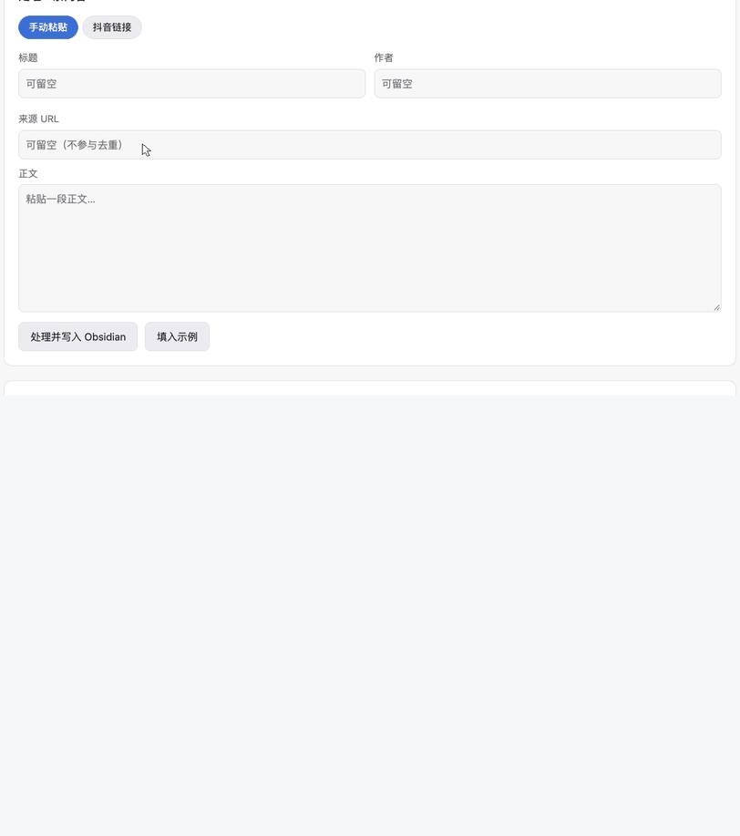
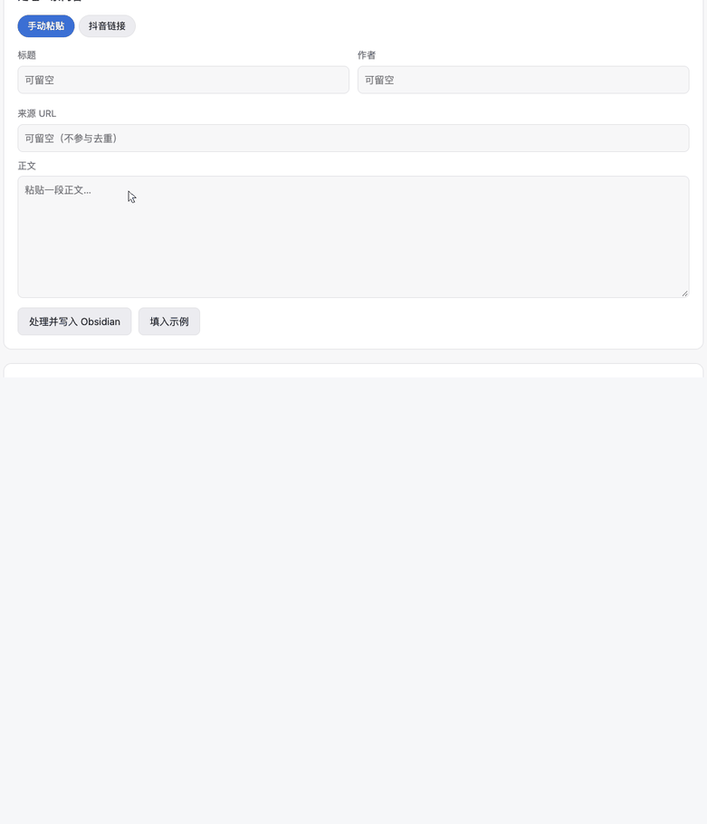
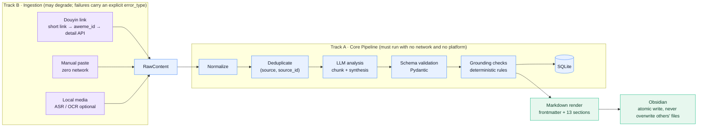

# KnowledgeFlow

[中文](README.md) ｜ **English**

[](https://github.com/y16689540962-cloud/knowledgeflow/actions/workflows/ci.yml)


**Don't let the model do your thinking for you.**

Clippers turn a video into text. This one goes a step further: it separates **what was
stated as fact from what was merely claimed**, and checks whether each statement can
actually be traced back to the source — decided by **deterministic rules, not by the
model's own say-so**.

Feed it a Douyin link, a block of pasted text, or a local audio/video/image file, and get
back a structured Obsidian note with **13 fixed sections**: summary, key points typed as
*fact / opinion / inference / prediction*, quotes with confidence, an explicit
"unverified" section, and `[[wikilinks]]` to entities and topics.

> **TL;DR** — Two-track architecture (a core pipeline that runs fully offline plus a
> degradation-tolerant ingestion layer), 1490 tests, 97% line coverage, a FastAPI
> backend, a zero-build web UI, a Chrome extension, and a **macOS Apple Silicon
> one-click installer**. **Personal / research use only.**

---

## macOS Apple Silicon (v0.4 one-click install)

> **Requirements:** macOS 12+ · Apple Silicon · Obsidian · an LLM API key.

**No Python to install, no terminal, no environment variables.** Download the DMG →
drag it into Applications → double-click → the wizard asks three things (vault / API key /
model) → the service starts and your browser opens.

### Installation

1. Download `KnowledgeFlow-macOS-arm64.dmg` (see [Releases](../../releases))
2. Open the DMG
3. Drag **KnowledgeFlow** to Applications
4. Launch KnowledgeFlow
5. Complete the first-run setup wizard

On first launch macOS may say the developer cannot be verified — this build is only
signed **ad-hoc**; there is no Apple Developer ID and no notarization yet.
**Do not disable any system security feature to work around it.** The correct step is:

- In Applications, **right-click KnowledgeFlow → Open**, then click **Open** again.
  You only have to do this once; afterwards a normal double-click works.

That is the standard macOS flow for an un-notarized app — it is not this app asking you
to lower your security settings.

### Where things live

| What | Where |
|---|---|
| The app | `/Applications/KnowledgeFlow.app` (self-contained runtime, 269 MB) |
| Your config (contains the API key, mode `0600`) | `~/Library/Application Support/KnowledgeFlow/config/settings.json` |
| Database | `~/Library/Application Support/KnowledgeFlow/data/knowledgeflow.db` |
| Logs | `~/Library/Application Support/KnowledgeFlow/logs/` (`app.log`, `launcher.log`) |
| Model cache | `~/Library/Application Support/KnowledgeFlow/cache/` |

**User data is never written inside the `.app`** — so replacing the app when you upgrade
won't touch your data, and deleting the app won't delete your notes.

### Command line (optional)

The app bundle is also a plain executable:

```bash
/Applications/KnowledgeFlow.app/Contents/MacOS/KnowledgeFlow --status   # is it running?
/Applications/KnowledgeFlow.app/Contents/MacOS/KnowledgeFlow --stop     # stop the service
/Applications/KnowledgeFlow.app/Contents/MacOS/KnowledgeFlow --setup    # re-run the wizard
/Applications/KnowledgeFlow.app/Contents/MacOS/KnowledgeFlow --check    # environment self-check
```

### Building the DMG from source

```bash
./scripts/build_macos_arm64.sh            # -> dist/KnowledgeFlow-macOS-arm64.dmg
./scripts/build_macos_arm64.sh --minimal  # without ASR/OCR, smaller bundle
```

In mainland China `files.pythonhosted.org` is frequently unreachable — pip then reports
"no matching distribution found", which looks like the package doesn't exist but actually
means it can't be downloaded. Point pip at a mirror:

```bash
KF_PIP_INDEX_URL=https://pypi.tuna.tsinghua.edu.cn/simple ./scripts/build_macos_arm64.sh
```

### Supported platform

**Current supported architecture: Apple Silicon / arm64.**

**Not supported: Intel Mac, Windows, Linux.** That's a deliberate choice, not a missing
afternoon of work — v0.4's goal is to make one platform genuinely installable rather than
three platforms half-finished. The backend itself is cross-platform (pure Python +
FastAPI); porting only needs a new packaging layer.

### Capability boundaries (shown honestly in the UI)

| Capability | Needs | If missing |
|---|---|---|
| Links / text → Obsidian | just an LLM API key | — |
| ASR (local speech-to-text) | bundled in the `.app` (faster-whisper) | first use downloads a model |
| OCR (text in images) | system `tesseract` | **silently disabled**, everything else works |
| Douyin ingestion | your own Douyin session (optional) | "manual paste" still works |

**ASR / OCR never block startup** — if the engine is absent it degrades and the UI says
"not enabled". Audio/video decoding goes through the bundled PyAV; **you do not need
ffmpeg installed**.

---

## ⚠️ Disclaimer (read this first)

- This project is **for learning and research only**, not for commercial use. It is
  **not affiliated with Douyin (ByteDance) or Obsidian**.
- Douyin ingestion uses **only your own account's session**, only issues GETs against
  public data, and **does not forge signatures, break encryption, or bypass CAPTCHAs**.
  When the platform blocks it, it reports the error honestly and makes no attempt to work
  around it. That boundary is pinned by tests.
- Scraping may be subject to platform terms of service. **Use at your own risk.**
- The extension icon is a faceted amethyst — an **homage to Obsidian's look, not its
  official logo**.

---

## What problem does this solve?

You watch a genuinely good short video. The information scatters: bookmarking means you
never look at it again, and taking notes by hand is too slow. But asking an LLM to
"summarize it" has two fatal problems:

1. **It can't tell facts from opinions** — the author's subjective prediction gets
   rewritten as a statement, and the reader can't tell.
2. **There are no citations** — details the model filled in on its own get mixed in with
   what the source actually said, and you have no way to separate them.

KnowledgeFlow's answer is to **separate "what the model said" from "what the rules
confirmed"**. The LLM does the summarizing and the typing; whether a statement can
actually be traced back to the source is decided by **deterministic rules**, and the
model's self-reported result is always overwritten. So every claim carries a quote and a
confidence score, and anything without textual support gets its own "unverified" section.

## Three entry points

| Entry point | How | Good for |
|---|---|---|
| **Chrome extension** | Open a Douyin video page → click the toolbar icon | everyday clipping |
| **Web UI** | `http://127.0.0.1:8000` — paste text or a link | no extension needed |
| **HTTP API** | `POST /api/ingest/{manual,douyin,media}` | scripts / automation |

### Screenshots

### Demo (6 seconds each)

**① Douyin link → a note** (real short-link resolution + detail API + real model)



**② Manual paste → a note**



> Both are **frame-by-frame composites**, not screen recordings (this machine has no
> screen-recording permission). The UI, the service and the model are all real — the
> seconds spent in `analyze` really were model calls; only the waiting was jump-cut,
> and the cursor is drawn in post.
>
> **The Douyin clip shows a real public video** (it demonstrates the real pipeline, so the
> share text, video title and author nickname are genuine); the manual-paste clip uses
> fabricated sample data.
> Video versions for social posts: `docs/images/demo-douyin.mp4`, `docs/images/demo-web-ui.mp4`.

### Screenshots

<table>
<tr>
<td width="50%"><br>
<b>Web UI</b> — input → 13-step trace with per-step timings (<code>analyze</code> dominates)</td>
<td width="50%"><br>
<b>Library</b> — status, source, time; inspect or reprocess</td>
</tr>
</table>

<p align="center">
  
  <br><b>Extension popup</b> — one click on a Douyin video page
</p>

> The titles and authors in the screenshots are **fabricated sample data**, but the three
> images differ in nature and it's worth being precise: the two Web UI shots are **a real
> service with a real LLM** (only the *input* is fabricated — the 9 seconds spent in
> `analyze` really were a model call); the extension popup is the real UI code driven by a
> stubbed response, because an extension popup cannot be opened without a human click.

---

## Quick start (from source)

### 0. Prerequisites

- **Python 3.11+** (developed on 3.13)
- macOS / Linux (Windows untested)
- An LLM API key (any OpenAI-compatible endpoint; tested with **DeepSeek**)
- An **Obsidian vault** (where the notes end up)

### 1. Install dependencies

```bash
git clone <this-repo> && cd knowledgeflow
python3 -m venv .venv
.venv/bin/pip install -r backend/requirements.txt
```

> In `requirements.txt`, ASR (faster-whisper) and OCR (pytesseract) are **optional**:
> failing to install them, or not having the engine, never blocks the core pipeline —
> everything is lazily loaded with explicit degradation. To run the core path only,
> comment out the last few lines.

### 2. Configure

```bash
cp backend/.env.example backend/.env
$EDITOR backend/.env
```

The minimum you need:

| Variable | Meaning |
|---|---|
| `LLM_PROVIDER` | `deepseek` or `openai` |
| `DEEPSEEK_API_KEY` / `OPENAI_API_KEY` | your own key, **stored only in your local `.env`** |
| `LLM_MODEL` | e.g. `deepseek-flash` (leave empty to use a default that may not exist on your account) |
| `OBSIDIAN_VAULT_PATH` | absolute path to your vault, e.g. `/Users/you/Documents/MyVault` |

`.env` is already in `.gitignore` — **do not commit it**.

### 3. Run the tests (do this first — it confirms your environment)

```bash
cd backend && ../.venv/bin/python -m pytest
```

Expected: **1490 passed / 16 skipped**. The 16 skips are by design:

- 4 real ASR / OCR tests (need the engines, plus a model download on first run)
- 2 real-browser end-to-end tests (need Playwright + Chrome)
- 10 guards over an internal progress document (that document is not published)

To run the real engines / browser:

```bash
KNOWLEDGEFLOW_REAL_OCR=1 ../.venv/bin/python -m pytest tests/test_ocr_real.py -v
KNOWLEDGEFLOW_REAL_ASR=1 WHISPER_MODEL_SIZE=small ../.venv/bin/python -m pytest tests/test_asr_real.py -v
KNOWLEDGEFLOW_BROWSER_TEST=1 ../.venv/bin/python -m pytest tests/test_web_ui_browser.py -v
```

### 4. Start the service

```bash
cd backend && ../.venv/bin/python scripts/serve.py --port 8000
```

Open `http://127.0.0.1:8000` for the UI; `/docs` is the generated API documentation.

> **Do not add `--expose`.** The service has no authentication. Binding it to `0.0.0.0`
> hands "write to your Obsidian vault / spend your LLM quota" to everyone on the LAN.
> If you need remote access, put it behind a reverse proxy with auth.

### 5. Chrome extension (optional)

`chrome://extensions/` → enable Developer mode → **Load unpacked** → pick the
`extension/` directory. See [`extension/README.md`](extension/README.md).

### 6. Autostart on login (macOS, optional)

```bash
cd backend && ./scripts/install_autostart.sh --install   # --status / --uninstall / --print
```

This installs a LaunchAgent (bound to `127.0.0.1` only, logs under
`~/Library/Logs/KnowledgeFlow/`, restarted if it dies). It's what makes the extension
genuinely "one click and done".

---

## Douyin ingestion needs your own session

As of 2026-09, Douyin **no longer server-renders its data** — the page body is a JS shell,
so metadata can only come from the detail API, and that API **requires a session**:
anonymous requests get HTTP 200 with an **empty body**.

So to ingest Douyin **without the extension** (or to have the server do it as a fallback),
configure `DOUYIN_COOKIE`:

1. Log in to Douyin in your browser
2. F12 → Network → click any request → copy the whole `Cookie` request header
3. Paste it after `DOUYIN_COOKIE=` in `backend/.env` and restart the service

This value is an **account-level credential**, more sensitive than an API key. The project
deliberately does not accept it "pasted into a chat" nor provide a "front-end input box" —
you write it into the gitignored `.env` yourself, and at runtime the code **only checks
whether it's present, never echoes it, never logs it**.

Failures come back with explicit error types: `COOKIE_REQUIRED` (no session) /
`REQUEST_BLOCKED` (hit a CAPTCHA page — not bypassed) / `AWEME_ID_NOT_FOUND` (no video id
in the URL) / `PARSER_UNSUPPORTED` (session present but no data).

---

## Architecture

**Two tracks** that never block each other:



> The boundary between the two tracks is hard: **if Douyin is down, the network is gone,
> or ASR isn't installed, track A still completes** — because track A's input is a
> `RawContent` that has already been obtained and contains no scraping at all.

```
backend/
  app/
    api/           FastAPI app (factory + explicit dependency injection)
    pipeline/      13-step main chain + task state machine + crash recovery
    providers/     LLM adapters (OpenAI-compatible / DeepSeek / Mock)
    llm/           JSON extraction and repair (format only), prompts, retry state machine
    chunking/      text budget → cleaning → sentence-level splitting → chunks
    grounding/     deterministic checks R1 / R2.1–2.3 / R3
    ingestion/     Douyin / manual paste / local media
    media/         streaming download + magic-number sniffing
    capabilities/  ASR / OCR (lazy load + explicit degradation)
    obsidian/      rendering + frontmatter + atomic writes + path safety
    knowledge/     entity / topic / alias normalization and merging
    db/            SQLAlchemy async (SQLite)
    web/           zero-build static UI
  scripts/         acceptance scripts + three quality guards
  tests/           1490 tests, fully offline
packaging/macos/   desktop launcher + Info.plist + app requirements
extension/         Chrome MV3 extension
```

## A few non-obvious design decisions

These were all learned the hard way. They live in code comments; here they are in one place:

- **Deduplication identity is `(source, source_id)`, not the URL.** The short link for the
  same video is different every time it's shared, so URL-based dedup reprocesses
  constantly. `source_id` is the platform's unique id (`aweme_id` for Douyin); when it
  can't be resolved it degrades to `hash:<first 16 chars of content_hash>` and is flagged
  for manual review.
- **`needs_verification` is decided entirely by rules**, whatever the model reports is
  overwritten. That is the direct answer to "facts and opinions get conflated".
- **Errors come in two kinds**: `CAPABILITY_UNAVAILABLE` (engine not installed → silent
  degradation) and `CAPABILITY_FAILED` (engine broke → reported honestly). Merging them
  swallows real failures as environment problems.
- **Logs and error messages never echo content** — only line/column numbers, field paths
  and lengths.
- **File names use only the original title, never the AI title** — the latter changes on
  reprocess and would create a second file.
- **Never overwrite a file we didn't write**: compare the identity in the frontmatter
  first; if it doesn't match, save alongside instead.
- **Source text goes inside a code fence**, with a fence longer than the longest backtick
  run in the body (otherwise `##` in the content turns into a fake heading).

## Quality

| Metric | Value |
|---|---|
| Tests | 1490 passed / 16 skipped (1506 total) |
| Line coverage | **97.0%** (`scripts/check_coverage.py` enforces a 90% floor) |
| Network needed to run tests | **none** — all via `httpx.MockTransport` / mock LLM |
| Verified against the real world | Douyin ingestion, DeepSeek analysis, ASR, OCR, browser E2E all really run |

The tests are written to **have teeth**, not to pad a count:

- **Negative mutation**: inject drift into the document and the checker must catch it —
  proving it isn't permanently green
- **Full enum coverage**: iterate every `ErrorType` member; forgetting to map an HTTP
  status turns the suite red
- **Consistency guard**: `scripts/check_doc_consistency.py` turns "the numbers printed in
  the docs" into a re-runnable check
- **Checkers never read source text**: they inspect real configuration (middleware
  arguments, argparse declarations) to avoid "the checker treats its own comments as
  evidence" — a trap this project fell into five times, each one now pinned by a test

## Known limitations

- **Without a Douyin session you cannot ingest Douyin content** (the platform moved to a
  JS shell plus an authenticated detail API). That's platform behaviour, not something
  this project can or will work around.
- **The Douyin home / recommendation feed cannot tell you "which video is playing right
  now"**: there's no video id in the URL, and the DOM isn't reliable under bot defences.
  The project **deliberately refuses to guess** (a wrong guess is invisible to you) and
  instead tells you to open the video.
- Douyin has no separate title field, so the caption `desc` serves as both title and body.
- If hashes computed by an older version (`content_hash` v1) coexist with v2, the same
  content can end up in two rows — a migration script is provided.
- Local media files have no natural unique id → they fall back to `hash:` and are flagged
  for manual review (by design).
- The service has no authentication and should only be bound to loopback.

## Security and privacy

- Your API key and Douyin cookie **live only in your local `.env`** (gitignored).
- **No telemetry, no phone-home**: the only outbound requests in the entire project are to
  your LLM provider and the target platform. You can verify that with grep.
- The Chrome extension requests only `activeTab` + `storage`, and its
  `host_permissions` cover only `http://127.0.0.1:8000/*`.
- Backend CORS **only allows `chrome-extension://`** origins, never arbitrary web pages
  (otherwise any page on your machine could call the ingestion API).
- The Douyin cookie is never echoed and never logged (pinned by tests).

## License

[MIT](LICENSE)
