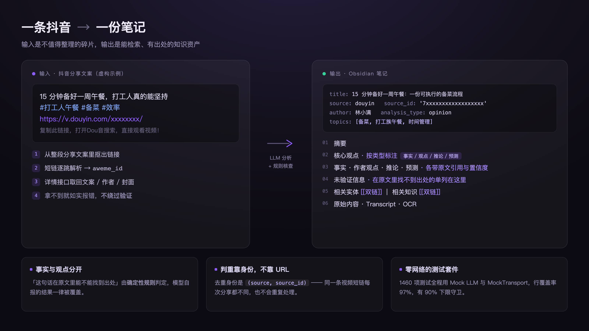
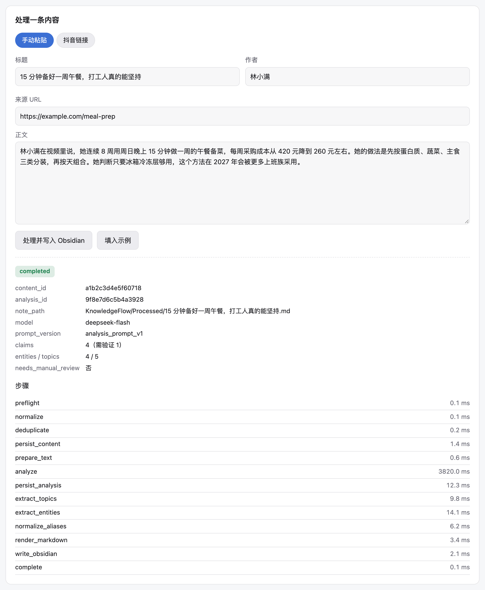
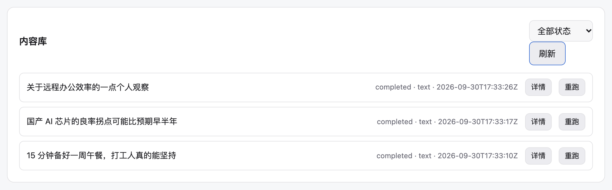
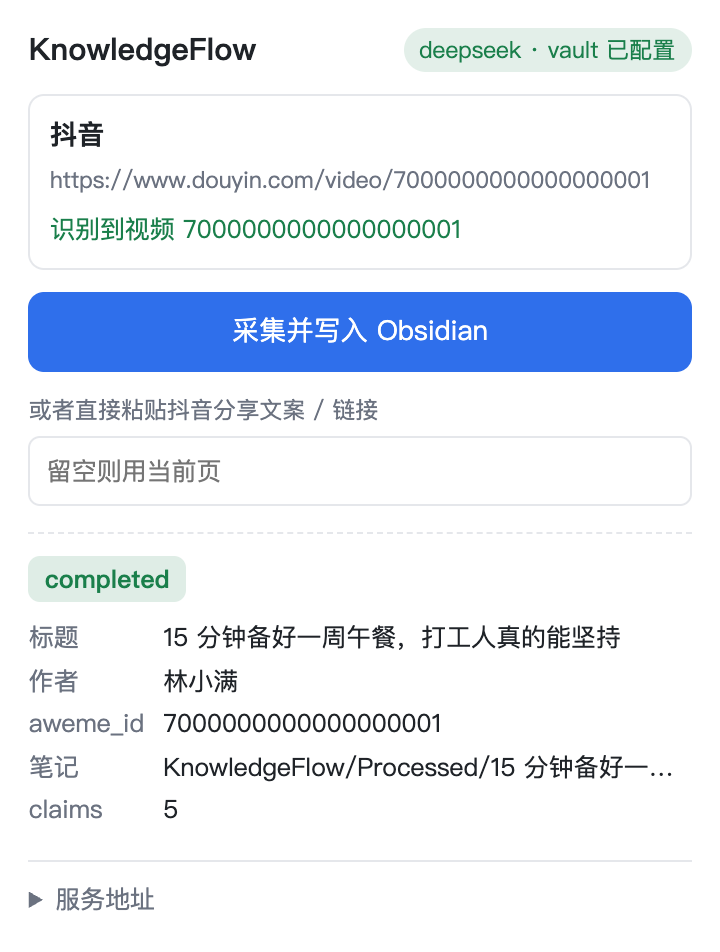
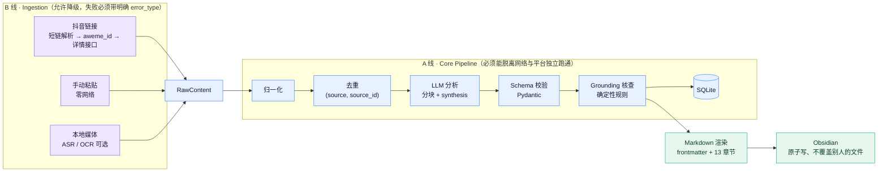

# KnowledgeFlow

[](https://github.com/y16689540962-cloud/knowledgeflow/actions/workflows/ci.yml)




**别让模型替你做判断。**

剪藏工具都在做「把内容转成文字」；这个项目多做一步：**分清哪句是事实、哪句是作者的观点或预测，
以及这句话在原文里到底有没有出处** —— 而且「有没有出处」不由模型自己说了算。

给一条抖音链接、一段手贴的文案、或者一个本地音视频文件，拿回一份**固定 13 个章节**的
Obsidian 笔记：摘要 / 核心观点（分事实·观点·推论·预测）/ 原文引用 / 未验证信息 /
相关实体与主题双链 / 全文逐字稿 ……

> **English TL;DR** — KnowledgeFlow turns short-video links, pasted text, and local
> media files into structured Obsidian notes. What makes it different from a clipper:
> whether a statement can actually be traced back to the source is decided by
> **deterministic rules, not by the model's own say-so** — so every claim carries a
> quote, and unsupported ones get their own section instead of being blended into the
> summary. An LLM pipeline with rule-based grounding checks, deterministic dedup,
> and a Chrome extension. Docs are in Chinese; code and tests read either way.
> **For personal / research use only.**

---

## macOS Apple Silicon（v0.4 一键安装版）

> KnowledgeFlow currently provides a native installation package for Apple Silicon Macs.
>
> Requirements: macOS 12+ · Apple Silicon · Obsidian · an LLM API key.

**不用装 Python、不用开终端、不用配环境变量。** 下载 DMG → 拖进 Applications → 双击 →
向导问三件事（Vault / AI Key / 模型）→ 服务起来、浏览器自动打开。

### Installation

1. Download `KnowledgeFlow-macOS-arm64.dmg`（见 [Releases](../../releases)）
2. Open the DMG
3. Drag **KnowledgeFlow** to Applications
4. Launch KnowledgeFlow
5. Complete the first-run setup wizard

首次打开可能提示「无法验证开发者」—— 因为这一版只做了 ad-hoc 签名，**没有** Apple
Developer ID 与公证（notarization）。**不要为此关闭系统安全功能**，正确做法是：

- 在「应用程序」里 **右键 KnowledgeFlow → 打开** → 再点一次「打开」；
  放行一次之后，之后双击就正常了。

这一步是 macOS 对未公证应用的标准流程，不是这个应用在要求你降低安全设置。

### 它把东西放在哪

| 内容 | 位置 |
|---|---|
| 程序本体 | `/Applications/KnowledgeFlow.app`（整个运行环境自包含，269 MB） |
| 你的配置（含 API Key，权限 `0600`） | `~/Library/Application Support/KnowledgeFlow/config/settings.json` |
| 数据库 | `~/Library/Application Support/KnowledgeFlow/data/knowledgeflow.db` |
| 日志 | `~/Library/Application Support/KnowledgeFlow/logs/`（`app.log` / `launcher.log`） |
| 模型缓存 | `~/Library/Application Support/KnowledgeFlow/cache/` |

**用户数据绝不写在 `.app` 里面** —— 所以升级（替换 .app）不会动你的数据，
删掉 .app 也不会连数据一起删。

### 命令行（可选）

应用本体就是一个可执行文件，需要时也能直接用：

```bash
/Applications/KnowledgeFlow.app/Contents/MacOS/KnowledgeFlow --status   # 看状态
/Applications/KnowledgeFlow.app/Contents/MacOS/KnowledgeFlow --stop     # 停服务
/Applications/KnowledgeFlow.app/Contents/MacOS/KnowledgeFlow --setup    # 重跑向导
/Applications/KnowledgeFlow.app/Contents/MacOS/KnowledgeFlow --check    # 环境自检
```

### 从源码构建 DMG

```bash
./scripts/build_macos_arm64.sh            # 产物：dist/KnowledgeFlow-macOS-arm64.dmg
./scripts/build_macos_arm64.sh --minimal  # 不带 ASR/OCR，包更小
```

国内网络下 `files.pythonhosted.org` 常被墙（表现为 pip 报「找不到包」，其实是下不动），
用镜像即可：

```bash
KF_PIP_INDEX_URL=https://pypi.tuna.tsinghua.edu.cn/simple ./scripts/build_macos_arm64.sh
```

### 当前支持的平台

**Current supported architecture: Apple Silicon / arm64。**

**暂不支持：Intel Mac、Windows、Linux。** 这不是没时间做，是刻意不做 ——
v0.4 的目标是把一个平台做到「装上就能用」，而不是三个平台都半成品。
后端本身是跨平台的（纯 Python + FastAPI），要移植只需要补打包层。

### 能力边界（会如实显示在界面上）

| 能力 | 需要什么 | 缺了会怎样 |
|---|---|---|
| 链接 / 文本 → Obsidian | 只要一个 LLM API Key | — |
| ASR（本地语音转写） | 已随 .app 内置（faster-whisper） | 首次使用需联网下载模型 |
| OCR（图片文字识别） | 需要系统装 `tesseract` | **自动停用**，其它功能不受影响 |
| 抖音采集 | 你自己的抖音登录态（可选配置） | 用「手动粘贴」照常可用 |

**ASR / OCR 永远不会阻塞启动** —— 引擎不在就降级，界面显示「未启用」。
音视频解码走内置的 PyAV，**不需要**系统安装 ffmpeg。


---

## ⚠️ 免责声明（先读这段）

- 本项目**仅供学习与研究**，不用于商业用途，**与抖音（字节跳动）及 Obsidian 官方均无关联**。
- 抖音采集**只用你自己账号的登录态**，只对公开数据做 GET，**不伪造签名、不破解加密、
  不绕过验证码**；被平台挡住时如实报错，不做任何绕过尝试。这条边界在代码里有测试钉死。
- 采集行为可能受平台服务条款约束，**使用者自负责任**。
- 扩展图标是紫水晶切面，**意象上致敬 Obsidian，不是它的官方 logo**。

---

## 它解决什么问题

看完一条讲得不错的短视频，信息就散了 —— 存书签不会再看，手动记又太慢。
而直接让 LLM「总结一下」有两个致命问题：

1. **分不清事实与观点**：作者的主观预测会被写成陈述句，读的人察觉不到；
2. **没有出处**：模型顺手补的细节和原文说的混在一起，你无从分辨。

KnowledgeFlow 的做法是：**把「模型说了什么」和「规则认了什么」分开**。
摘要与分类交给 LLM；「这句话能不能在原文里找到出处」由**确定性规则**判定，
模型自报的结果一律被规则覆盖。所以每条 claim 都带原文引用与置信度，
找不到出处的会被单列进「未验证信息」。

## 三个入口

| 入口 | 怎么用 | 适合 |
|---|---|---|
| **Chrome 扩展** | 打开抖音视频页 → 点工具栏图标 | 日常剪藏 |
| **Web 界面** | `http://127.0.0.1:8000` 手动粘贴 / 抖音链接 | 不用装扩展 |
| **HTTP API** | `POST /api/ingest/{manual,douyin,media}` | 脚本 / 自动化 |

### 界面

<table>
<tr>
<td width="50%"><br>
<b>Web 界面</b> —— 录入 → 13 步执行明细（每步耗时，<code>analyze</code> 占绝大部分）</td>
<td width="50%"><br>
<b>内容库</b> —— 状态、来源、时间，可看详情 / 重跑</td>
</tr>
</table>

<p align="center">
  
  <br><b>Chrome 扩展面板</b> —— 抖音视频页点一下，出结果只要一次点击
</p>

> 截图里的标题与作者都是**虚构示例数据**，但三张图的性质不同，说清楚：
> Web 界面那两张是**真实服务 + 真实 LLM 跑出来的结果**（只有输入内容是虚构的，
> `analyze` 那一步 9 秒是真的在调用模型）；扩展面板那张是真实界面代码配示例响应
> —— 扩展的弹出面板没法在无人操作的情况下自动打开，这点如实说明。

---

## 快速开始

### 0. 前置

- **Python 3.11+**（开发环境是 3.13）
- macOS / Linux（Windows 未验证）
- 一个 LLM API Key（OpenAI 兼容即可，实测用的是 **DeepSeek**）
- 一个 **Obsidian 库**（笔记最终写到那里）

### 1. 装依赖

```bash
git clone <this-repo> && cd knowledgeflow
python3 -m venv .venv
.venv/bin/pip install -r backend/requirements.txt
```

> `requirements.txt` 里 ASR（faster-whisper）与 OCR（pytesseract）是**可选能力**：
> 装不上或没装引擎不会阻塞主链路，代码里全是懒加载 + 明确降级。
> 只想跑核心链路的话，把最后那几行注释掉即可。

### 2. 配置

```bash
cp backend/.env.example backend/.env
$EDITOR backend/.env
```

至少要填这几项：

| 变量 | 说明 |
|---|---|
| `LLM_PROVIDER` | `deepseek` 或 `openai` |
| `DEEPSEEK_API_KEY` / `OPENAI_API_KEY` | 你自己的 key，**只存在本机 `.env`** |
| `LLM_MODEL` | 例如 `deepseek-flash`（不填会用默认值，可能不是你账号可用的模型） |
| `OBSIDIAN_VAULT_PATH` | 你的 Obsidian 库绝对路径，例如 `/Users/you/Documents/MyVault` |

`.env` 已在 `.gitignore` 里 —— **不要提交它**。

### 3. 跑测试（建议先做，确认环境是对的）

```bash
cd backend && ../.venv/bin/python -m pytest
```

期望：**1450 passed / 16 skipped**。16 条 skip 是设计如此：

- 4 条真实 ASR / OCR（需要装引擎，首次还要联网下模型）
- 2 条真实浏览器端到端（需要 Playwright + Chrome）
- 10 条内部进度文档的口径守卫（那份文档不随开源仓库发布）

想跑真实引擎 / 浏览器：

```bash
KNOWLEDGEFLOW_REAL_OCR=1 ../.venv/bin/python -m pytest tests/test_ocr_real.py -v
KNOWLEDGEFLOW_REAL_ASR=1 WHISPER_MODEL_SIZE=small ../.venv/bin/python -m pytest tests/test_asr_real.py -v
KNOWLEDGEFLOW_BROWSER_TEST=1 ../.venv/bin/python -m pytest tests/test_web_ui_browser.py -v
```

### 4. 起服务

```bash
cd backend && ../.venv/bin/python scripts/serve.py --port 8000
```

打开 `http://127.0.0.1:8000` 就是界面；`/docs` 是自动生成的 API 文档。

> **不要加 `--expose`。** 服务没有鉴权，绑到 `0.0.0.0` 等于把「写你 Obsidian 库、
> 用你 LLM 额度」的接口开放给局域网。要对外开放请自己加反向代理 + 鉴权。

### 5. Chrome 扩展（可选）

`chrome://extensions/` → 开启开发者模式 → **加载已解压的扩展程序** → 选 `extension/` 目录。
详见 [`extension/README.md`](extension/README.md)。

### 6. 开机自启（macOS，可选）

```bash
cd backend && ./scripts/install_autostart.sh --install   # --status / --uninstall / --print
```

装一个 LaunchAgent（只绑 `127.0.0.1`、日志落 `~/Library/Logs/KnowledgeFlow/`，
挂了自动拉起）。装了它，扩展才能做到「点一下就完事」。

---

## 抖音采集：需要你自己的登录态

实测（2026-09）抖音页面已经**不再服务端渲染数据** —— 正文只有一个 JS 壳页，
所以元数据只能走详情接口，而该接口**要求登录态**：匿名访问返回 HTTP 200 + **空正文**。

所以想在**没有安装扩展**的情况下采集抖音（或让服务端兜底），需要配 `DOUYIN_COOKIE`：

1. 浏览器登录抖音（网页版）
2. F12 → Network → 随便点一个请求 → 复制请求头里的 `Cookie` 整串
3. 粘进 `backend/.env` 的 `DOUYIN_COOKIE=` 后面，重启服务

这个值是**账号级凭据**，比 API Key 还敏感 —— 项目刻意不做「贴到对话里」也不做
「前端输入框」，只让你自己写进被 gitignore 的 `.env`；运行期**只判断有没有、
值不回显、不进日志**。

采集失败时错误类型是明确的：`COOKIE_REQUIRED`（缺登录态）/ `REQUEST_BLOCKED`
（撞验证页，不绕过）/ `AWEME_ID_NOT_FOUND`（地址里没有视频 id）/
`PARSER_UNSUPPORTED`（有登录态但拿不到数据）。

---

## 架构

**双轨**，且**互不阻塞**：



> 两条线的边界是硬性的：**抖音挂了、网络断了、ASR 没装，A 线照样能跑完** ——
> 因为 A 线的输入是已经拿到的 `RawContent`，不含任何采集动作。

```
backend/
  app/
    api/           FastAPI 应用（工厂 + 依赖显式注入）
    pipeline/      13 步主链路 + 任务状态机 + 崩溃恢复
    providers/     LLM 适配（OpenAI 兼容 / DeepSeek / Mock）
    llm/           JSON 抽取与修复（只修格式）、提示词、重试状态机
    chunking/      文本预算 → 清理 → 句级切分 → 分块
    grounding/     确定性核查规则 R1 / R2.1–2.3 / R3
    ingestion/     抖音 / 手动粘贴 / 本地媒体
    media/         流式下载 + 魔数嗅探
    capabilities/  ASR / OCR（懒加载 + 明确降级）
    obsidian/      渲染 + frontmatter + 原子写 + 路径安全
    knowledge/     实体 / 主题 / 别名归一化与合并
    db/            SQLAlchemy async（SQLite）
    web/           零构建静态界面
  scripts/         一致的验收脚本 + 三个质量守卫
  tests/           1450+ 项，全程离线
extension/         Chrome MV3 扩展
```

## 几个不那么显然的设计决定

这些是踩过之后才定下来的，写在代码注释里，也在这里列一下：

- **去重身份是 `(source, source_id)`，不是 URL。** 同一条视频的短链每次分享都可能不同，
  靠 URL 判重会重复处理。`source_id` 是平台唯一 id（抖音即 `aweme_id`），
  拿不到时退化成 `hash:<content_hash 前 16 位>` 并标记需人工复核。
- **`needs_verification` 完全由规则决定**，模型填什么都被覆盖。这是「事实与观点会被混淆」
  这个问题的正面回答。
- **错误分两类**：`CAPABILITY_UNAVAILABLE`（引擎没装 → 静默降级）与
  `CAPABILITY_FAILED`（引擎出错 → 如实报）。混在一起会把真错误当环境问题吞掉。
- **日志与错误消息永不回显正文**，只用行列号 / 字段路径 / 长度。
- **文件名只用内容原始标题，绝不用 AI 标题** —— 后者在重跑后会变，会生成第二个文件。
- **绝不覆盖不是自己写的文件**：写之前比对 frontmatter 里的身份，不一致就另存。
- **原文进代码围栏**，且围栏长度 > 正文里最长的反引号串（否则正文的 `##` 会变成假标题）。

## 质量

| 指标 | 数值 |
|---|---|
| 用例 | 1450 passed / 16 skipped（共 1466） |
| 行覆盖率 | **97.0%**（`scripts/check_coverage.py` 有 90% 下限守卫） |
| 运行网络依赖 | **零** —— 全部用 `httpx.MockTransport` / Mock LLM |
| 真实联网验证 | 抖音采集、DeepSeek 分析、ASR、OCR、浏览器端到端都真跑过 |

测试刻意写得「有牙」，而不是凑数量：

- **负向变异**：往文档里注入漂移，检查器必须抓到 —— 证明它不是永远绿
- **枚举全覆盖**：遍历 `ErrorType` 全成员，漏登记 HTTP 状态码就红
- **口径一致性**：`scripts/check_doc_consistency.py` 把「文档里印的数字」变成可复跑检查
- **检查器不许看源码文本**：一律查真实配置（中间件入参、argparse 声明），
  避免「检查器把自己的注释当证据」—— 这个坑本项目栽过五次，每次都在测试里留了注释

## 已知限制

- **没有抖音登录态就采不到抖音内容**（平台已改成 JS 壳页 + 详情接口要登录）——
  这是平台行为，不是本项目能绕过的，也不会去绕。
- **抖音首页 / 推荐流拿不到「当前正在播放哪条」**：地址里没有视频 id，页面 DOM 在
  风控下也不可靠。项目**刻意不猜**（猜错你不会察觉），而是明确提示去点开视频。
- 抖音没有独立标题字段，用文案 `desc` 同时当标题和正文。
- 旧版本算的 `content_hash`（v1）与 v2 并存时，同一条内容可能落到两行 —— 提供迁移脚本。
- 本地媒体文件没有天然唯一 id → 走 `hash:` 兜底并标记需人工复核（设计如此）。
- 服务无鉴权，只应绑回环地址。

## 安全与隐私

- 你的 API Key 与抖音 Cookie **只存在本机 `.env`**（已 gitignore）。
- **没有遥测、没有回传**：全项目的出网请求只有你的 LLM 服务商与目标平台。可以自己 grep 验证。
- Chrome 扩展只申请 `activeTab` + `storage`，`host_permissions` 只有 `http://127.0.0.1:8000/*`。
- 后端 CORS **只放行 `chrome-extension://`** 来源，不放行任意网页
  （否则本机随便一个页面都能调采集接口）。
- 抖音 Cookie 不回显、不进日志（有测试钉死）。

## License

[MIT](LICENSE)
